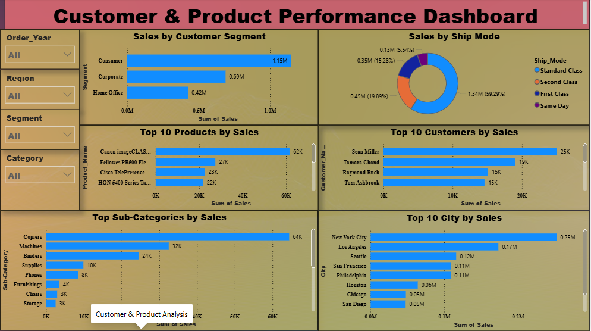
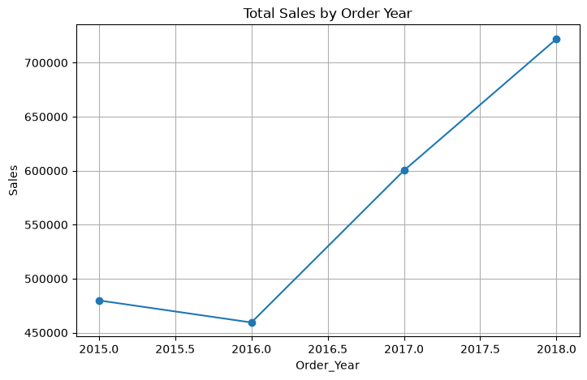
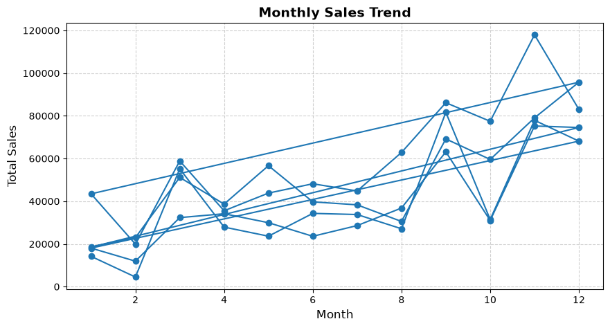
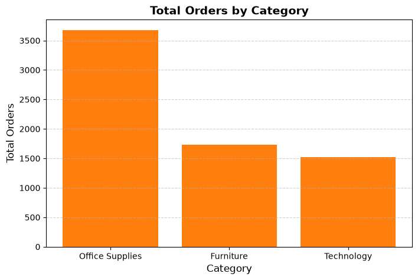
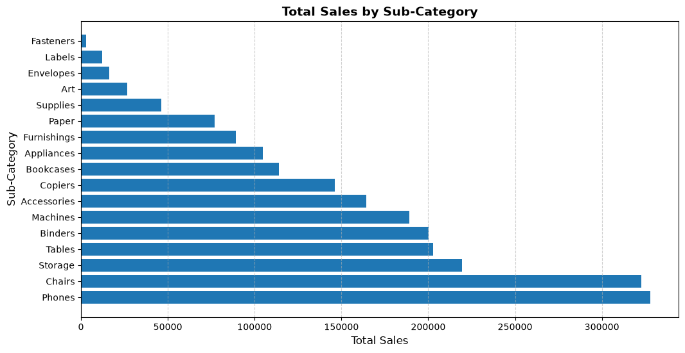
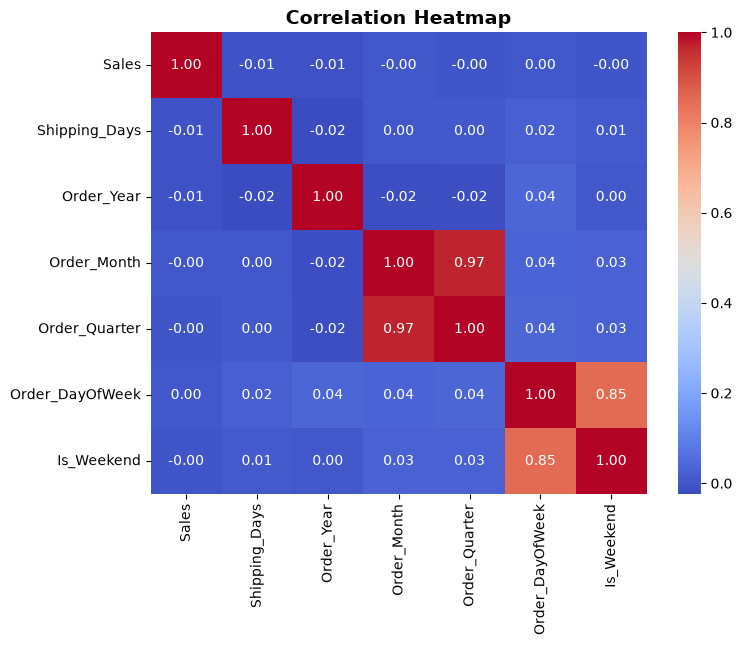

# 🛍️ Retail Sales Analysis & Executive Dashboard

## 📌 Project Overview

This project analyzes a retail sales dataset using **Python**, **Pandas**, **NumPy**, **Matplotlib**, and **Power BI**. The goal is to discover business insights through Exploratory Data Analysis (EDA) and present them using an interactive Executive Dashboard.

---

# 🎯 Business Questions

- How have sales changed over time?
- Which product categories generate the most revenue?
- Which regions perform best?
- Which customer segments contribute the most sales?
- Which products are top performers?
- What seasonal trends exist?
- Which shipping methods are preferred?

---

# 🛠️ Tools Used

- Python
- Pandas
- NumPy
- Matplotlib
- Power BI
- Jupyter Notebook
- Git & GitHub

---

# 📊 Power BI Dashboard

## Executive Dashboard


---

## Customer & Product Dashboard



---

# 📈 Key Business Insights

- Total Sales: **$2.26M**
- Technology generated the highest revenue.
- West region achieved the highest sales.
- Consumer segment generated the highest revenue.
- Sales temporarily declined during 2016 before recovering strongly.
- November and December recorded the highest sales.
- Standard Class was the most frequently used shipping mode.

---

# 📷 Exploratory Data Analysis

## Total Sales Over Year



---

## Monthly Sales Trend



---

## Orders by Category



---

## Total Sales by Sub Category



---

## Correlation Heatmap



---

# 📂 Repository Structure

```text
Retail-Sales-Analysis
│
├── README.md
├── Retail_Sales_Analysis.ipynb
├── Retail_Sales_Analysis_Report.pdf
├── Superstore.csv
├── retail_store_dashboard.pbix
│
└── images/
    ├── dashboard retail_store page 1.png
    ├── page 2 dashboard retail_store.png
    ├── total sale over year.png
    ├── monthly sales trend.png
    ├── oder by ctegory.png
    ├── total sales by sub category.png
    └── correlation.png
```

---

# 🚀 How to Run

1. Clone this repository.
2. Install the required Python libraries.
3. Open `Retail_Sales_Analysis.ipynb`.
4. Run all notebook cells.
5. Open `retail_store_dashboard.pbix` in Power BI Desktop.

---

# 👨‍💻 Author

**Muhammad Asaam Ali**

Aspiring Data Analyst

Skills:
- Python
- SQL
- Power BI
- Pandas
- NumPy
- Excel

---

⭐ If you found this project useful, please consider giving it a star.
